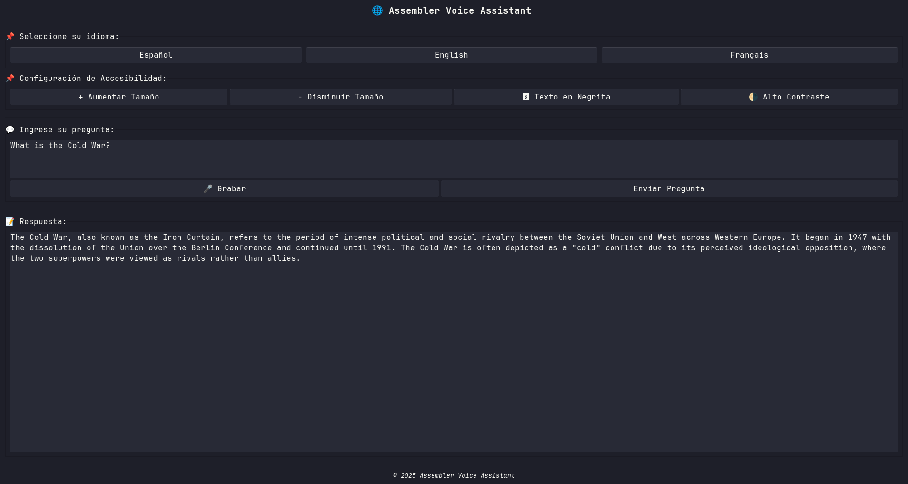

# Assembler Voice Assistant

Un asistente de voz mínimo programado en C++ y x86 Assembly.

<p align="center">
  
</p>

El propósito de este proyecto es demostrar cómo la programación de bajo nivel puede integrarse con tecnologías de más alto nivel con el fin de crear aplicaciones prácticas.

---

## 🧠 Funcionalidades principales

- Reconocimiento de voz local con [PocketSphinx](https://github.com/cmusphinx/pocketsphinx)
- Interfaz gráfica con GTK3
- Comunicación con un LLM local (DeepSeek) mediante una API
- Comandos por voz simples y respuesta textual
- Componentes escritos en C++ y x86 Assembly

---

## 📁 Estructura del proyecto

```
.
├── src/             # Código fuente en C++ y ASM
├── obj/             # Archivos objeto generados
├── assets/          # Recursos gráficos y fuentes
├── Makefile         # Script de compilación
└── README.md        # Este archivo

````

---

## 🧰 Requisitos

- Sistema operativo: Linux x86_64
- NASM (ensamblador)
- g++ (compilador C++)
- GTK3
- PulseAudio
- PocketSphinx
- Docker + Ollama
- Node.js + npm (para la API)

---

## 📦 Instalación de dependencias en Ubuntu/Debian

```bash
sudo apt update
sudo apt install \
  build-essential nasm g++ \
  libgtk-3-dev \
  pulseaudio \
  pocketsphinx pocketsphinx-en-us
````

---

## 🛠️ Compilación

Desde la raíz del proyecto:

```bash
make
```

Esto generará el ejecutable `voice_assistant` en el directorio actual.

---

## 🚀 Ejecución

### 1. Iniciar el modelo DeepSeek

Para que el asistente se comunique con el modelo, primero debe iniciar la API y el modelo LLM localmente.

#### a. Clonar la API

```bash
git clone https://github.com/Sleyter28/assembler-recognizer-be
cd assembler-recognizer-be
```

#### b. Instalar dependencias y modelo con Docker

```bash
docker compose up  # Inicia el contenedor con DeepSeek y Ollama
```

#### c. Iniciar el servidor de la API

En otra terminal:

```bash
npm install
npm run dev
```

La API se ejecutará en `http://localhost:3000/api`.

---

### 2. Iniciar el asistente

En la raíz del proyecto:

```bash
./voice_assistant
```

Al ejecutar el binario, se abrirá una ventana con la interfaz. El asistente escuchará comandos por voz y enviará la transcripción al modelo LLM para su interpretación. También se puede enviar el prompt como texto directamente.

---

## 🧪 Prueba de API con Postman

Para verificar si el backend está funcionando correctamente:

1. Abrir [Postman](https://www.postman.com/)
2. Hacer una solicitud `POST` a:
   `http://localhost:3000/api/ollama/deepseek`
3. En el cuerpo JSON, enviar algo como:

```json
{
  "prompt": "¿Cuál es la capital de Francia?",
  "model": "deepseek-r1:1.5b"
}
```

---

## 🐞 Problemas comunes

| Error                                             | Solución                                                                                    |
| ------------------------------------------------- | ------------------------------------------------------------------------------------------- |
| `docker: command not found`                       | Instalar Docker: [https://docs.docker.com/get-docker/](https://docs.docker.com/get-docker/) |
| `Error: pull model manifest: file does not exist` | Asegúrese de tener el modelo cargado en Ollama (`ollama run deepseek`)                      |
| GTK error al lanzar                               | Verifique que `libgtk-3-dev` está correctamente instalado                                   |
| No detecta micrófono                              | Confirme que PulseAudio está corriendo (`pulseaudio --start`)                               |

---

## 📜 Licencia

Este proyecto está licenciado bajo la [MIT License](./LICENSE).

---

## 👤 Créditos

* [@doctuspullus](https://github.com/doctuspullus)
* [@YiYhuan](https://github.com/YiYhuan)
* [Sleyter28](https://github.com/Sleyter28) — API para conectar con una instancia local de DeepSeek

---
